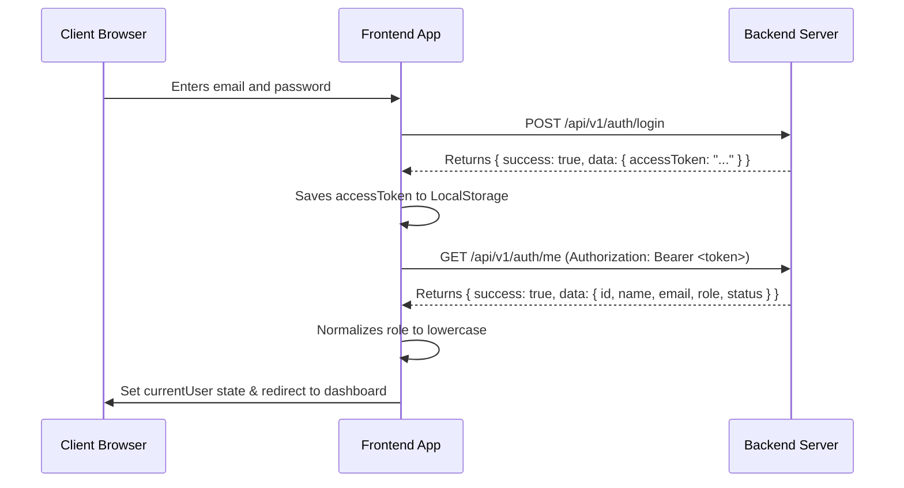

# Walkthrough - Frontend Auth Flow Refactor

We have successfully refactored the frontend authentication system to align with the new backend auth flow:
1. Removed all JWT decoding logic and mock profile mappings.
2. Implemented profile fetching from `GET /api/v1/auth/me`.
3. Converted session restoration to be asynchronous.

## Type Definition Mapping

The relationship between the backend DTO types and the frontend interfaces is outlined below:

### Final LoginResponse Type
The API response envelope is `ApiResponse<LoginResponseDTO>`. The inner payload structure is:
```typescript
interface LoginResponseDTO {
  accessToken: string;
  user: AuthUserResponse;
}
```

### Final AuthUserResponse Type
The user profile schema returned by `/api/v1/auth/me` and stored in the login payload:
```typescript
interface AuthUserResponse {
  id: number;
  name: string;
  email: string;
  role: "TEACHER" | "ADMIN"; // Normalized to "teacher" | "admin" in frontend
  status: "ACTIVE" | "INACTIVE";
}
```

---

## Authentication Flow Walkthrough

### 1. Login Flow


### 2. Restore Session Flow
On application boot, `useEffect` inside `App.tsx` triggers session restoration:
- Checks for an existing token in `localStorage.getItem("token")`.
- If a token is found, makes an async call to `GET /api/v1/auth/me` with Bearer auth.
- If successful, normalizes the user's role and sets the `currentUser` state, navigating to the default dashboard.
- If `/me` returns `401 Unauthorized` or `403 Forbidden`:
  - Token is cleared.
  - Returns `null`.
  - App state is reset to `null` and navigates back to the Login screen.

### 3. Logout Flow
- Triggers strictly on the client side.
- Clears the `"token"` from LocalStorage.
- Sets the `currentUser` state in `App.tsx` to `null`.
- Redirects user to the Login page.

---

## Verification and Type Checking
- Running the type-check validation in the frontend workspace completed successfully without any compilation errors:
  ```powershell
  npx tsc --noEmit
  ```
  *(Command output was completely empty, indicating 100% correct type checks)*
